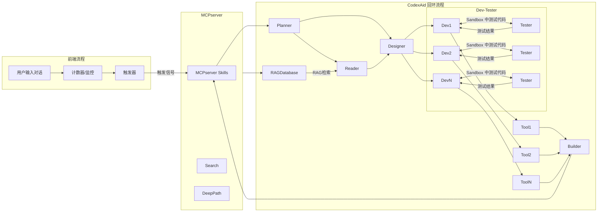

```mermaid
flowchart LR
  subgraph MCPSs["MCPserver"]
    MCP[MCPserver Skills]
    MCP1[Search]
    MCP2[DeepPath]
  end

  subgraph Frontend["前端流程"]
    A[用户输入对话] --> B[计数器/监控]
    B --> C[触发器]
    C -->|触发信号| MCP
  end

  MCPSs --> RAG

  subgraph CodexAid["CodexAid 回环流程"]
    MCP --> D[Planner]
    D --> E[Reader]
    D --> F[Designer]
    RAG[RAGDatabase] -->|RAG检索| E
    E --> F
    F --> G1[Dev1]
    F --> G2[Dev2]
    F --> G3[DevN]
    click G1 href "javascript:void(0)" "Dev 与 Tester 交流循环"
    subgraph DevTesterLoop["Dev-Tester"]
      G1 <-->|Sandbox 中测试代码| T1[Tester]
      G2 <-->|Sandbox 中测试代码| T2[Tester]
      G3 <-->|Sandbox 中测试代码| Tn[Tester]
      T1 -->|测试结果| G1
      T2 -->|测试结果| G2
      Tn -->|测试结果| G3
    end
    G1 --> TT1[Tool1] --> Builder
    G2 --> TT2[Tool2] --> Builder
    G3 --> TT3[ToolN] --> Builder
    Builder --> MCP
  end
```